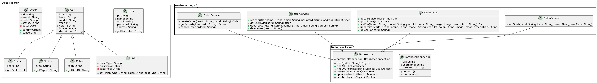

# Авдошко Иван, гр. 253505

## Описание проекта
### Веб-приложение для модификации внешнего вида автомобилей.
 >Предназначено для того, чтобы пользователи могли выбрать автомобиль, кастомизировать в соответствии со своими желаниями и оформить его заказ. Пользователям будут доступны некоторые модели автомобилей и варианты их кастомизации, из которых они смогут выбрать подходящую для себя комплектацию кузова, салона, характеристик и др.

 ## Диаграмма классов

 ## Функционал
 ### ___Data Model___
 ### Class User
 * id: String - уникальный идентификатор пользователя
 * name: String - имя пользователя
 * email: String - почтовый адрес пользователя
 * adress: String - регион проживания пользователя
 * getUserInfo(): String - получение информации о пользователе

 ### Class Car
 * id: String - уникальный идентификатор авто
 * brand: String - марка автомобиля
 * model: String - модель автомобиля
 * year: Int - год выпуска автомобиля
 * color: String - цвет корпуса автомобиля
 * image: Image - изображение автомобиля
 * description: String - общее описание характеристик авто
### Class Sedan
* type: String - указывает на принадлежность авто к спортивному типу или к повседневному
### Class Coupe
* seats: Int - количество мест для сидения (2 или 4)
### Class Cabrio
* roof: String - материал крыши (ткань или металл)
### Class Salon 
* finishType: String - материал отделки салона
* finishKolor: String - цвет отделки салона
* seatType: String - тип сидений
* setFinish(type: String, color: String, seatType: String) - метод для установки отделки салона автомобиля
### Class Order
* id: String - уникальный идентификатор заказа
* userId: String - уникальный идентификатор заказчика
* carId: String - уникальный идентификатор заказанного авто
* status: String - статус заказа
* date: Date - дата оформления заказа

### ___Business Logic___
### Class OrderService
* createOrder(userId: String, carId: String): Order - метод для создания нового заказа на покупку автомобиля
* getOrderById(orderId: String): Order - метод для получения информации о заказе по его идентификатору
* canselOrder(orderId: String) - метод для отмены заказа по его идентификатору  
### Class UserService
* registerUser(name: String, email: String, password: String adress: String): User - метод для регистрации пользователя на платформе
* getUserById(userId: String): User - метод для получения информации о пользователе по его ID
* updateUser(userId: String, name: String, email: String, adress: String) - метод для обновления информации о пользователе
* deleteUser(userId: String) - метод для удаления информации о пользователе
### Class CarService
* getCarById(carId: String): Car - метод для получения информации об автомобиле по его идентификатору
* getAllCars(): List\<Car> - метод для просмотра списка автомобилей
* addCar(brand: String, model: String, year: Int, color: String, image: Image, description: String): Car - метод для добавления нового автомобиля в каталог
* updateCar(carId: String, brand: String, model: String, year: Int, color: String, image: Image, description: String) - метод для обновления информации об автомобиле
* deleteCar(carId: String) - метод для удаления информации об автомобиле
### Class SalonService
* setFinish(carId: String, type: String, color: String, seatType: String) - метод  для установки отделки салона конкретного автомобиля

